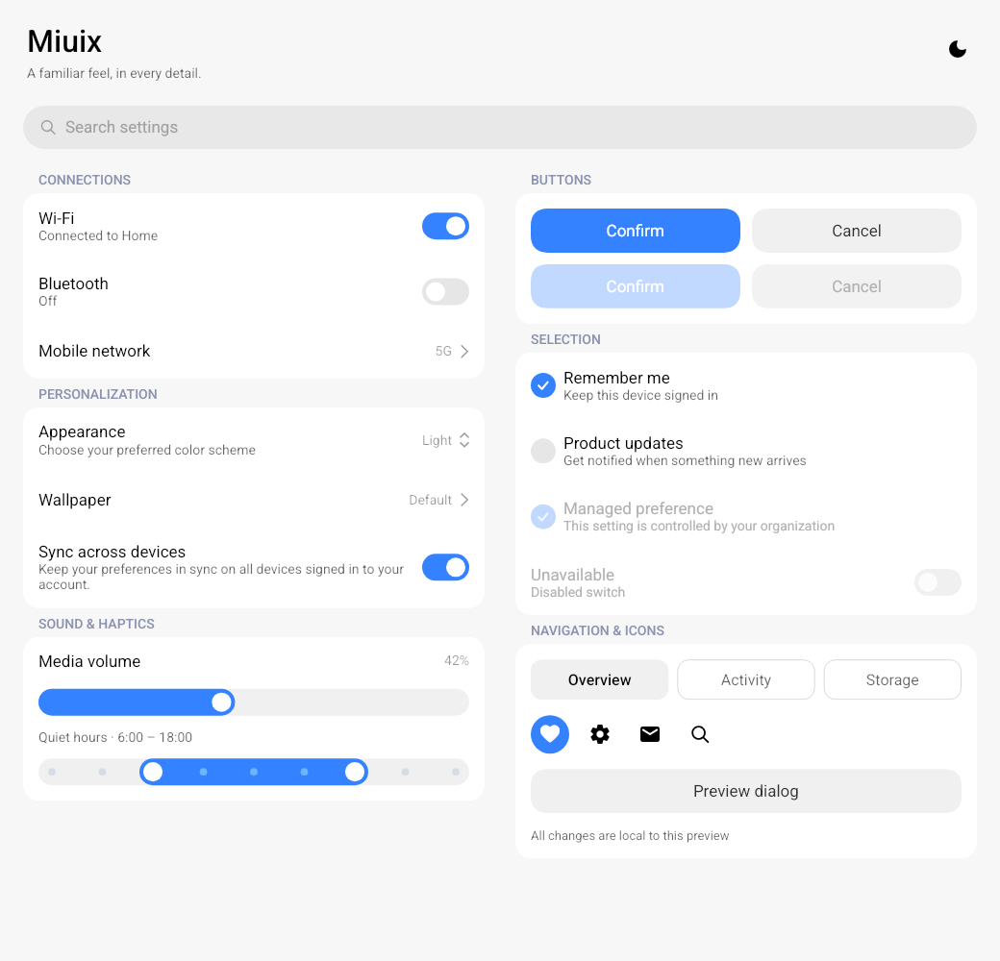

# miuix-qml

HyperOS / MIUIX components running on [qml4j](https://github.com/TIMER-err/qml4j), with visual tokens and geometry adapted from [compose-miuix-ui/miuix](https://github.com/compose-miuix-ui/miuix).



## Run with the current engine

Keep the two checkouts alongside each other:

```text
projects/
  qml4j/
  miuix-qml/
```

From this repository:

```bash
./run.sh
QML4J_DARK=true ./run.sh
./run.sh showcases/MiuixGalleryShowcase.qml
./run.sh showcases/MiuixOverlayShowcase.qml
./run.sh showcases/MiuixInputShowcase.qml
```

Set `QML4J_DIR=/path/to/qml4j` for another location. The launcher rebuilds the local engine and places its compiled classes before Maven dependencies, so it runs the current source. The default showcase switches between one and two columns at 760 px, and the sun/moon action changes the theme live.

The companion desktop launcher prefers native Wayland in a Linux Wayland session and defaults NVIDIA driver threaded optimizations to off for that process, with vsync on. This combination avoided the captured old-frame reversals on the tested NVIDIA/KDE machine (1287 recorded frames with no submission-counter decrease). Set `QML4J_PLATFORM=x11` to select X11 or `QML4J_PLATFORM=auto` to use GLFW's selection policy; an explicit `__GL_THREADED_OPTIMIZATIONS` value is preserved. `QML4J_FRAME_STAMP=true ./run.sh` enables the optional submission counter for further diagnosis.

In a Wayland session, X11 now defaults to an EGL context. Raw OpenGL comparisons and the actual showcase showed no reversal on this path with driver threading disabled, including when unfocused. `QML4J_GL_CONTEXT=native QML4J_PLATFORM=x11` restores GLX for diagnosis. These Linux observations do not establish a Windows fix.

The baseline engine integration includes desktop/raster font setup (`HostFonts`) and Row/Column size-binding preservation (`PositionerSizing`) from the previous alignment pass. Use that source build for the showcase and checks; these changes are not yet in a released engine artifact. The desktop host uses project `fonts/` overrides when supplied, otherwise its bundled Roboto and Material Symbols fonts.

## Use components

Point the engine's resource loader at this repository, then `import miuix.Core`. Public names retain the existing `md3.Core` conventions where they overlap, including `Button`, `Switch`, and `Theme.color.primary`.

```qml
import QtQuick
import miuix.Core

Rectangle {
    width: 390
    height: 700
    color: Theme.color.surface
    Column {
        width: parent.width
        SmallTitle { text: "Network"; width: parent.width }
        Card {
            x: 12
            width: parent.width - 24
            height: rows.height
            Column {
                id: rows
                width: parent.width
                SuperSwitch { title: "Wi-Fi"; summary: "Home"; checked: true }
                SuperSwitch { title: "Bluetooth" }
            }
        }
    }
}
```

Preference rows wrap their text and compute their height from content plus 16 px padding. Use a `Column` and its measured height for a group of rows instead of fixed `y: 56` offsets.

## Updated components

| Component | Behavior |
| --- | --- |
| `BasicComponent` | Shared preference layout with `title`, `summary`, `startAction` / `endAction` components, padding, disabled state, and `clicked()` |
| `SuperSwitch`, `SuperCheckbox` | Clickable whole rows, single toggle notification, wrapped summaries, disabled state; checkbox also supports `indeterminate` |
| `SuperArrow`, `SuperDropdown` | Bounded trailing text and upstream arrow geometry; dropdown exposes `menuOpen` and `selectOnClick` |
| `SearchBar` | Visible placeholder, input focus, optional clear button, `clear()` and `cleared()` |
| `Button` | Content-based height honoring `verticalPadding`, configurable `cornerRadius`, correct disabled primary-button colors |
| `Slider` | Single/range selection, stepped dragging, optional ticks/value label, reverse direction, separate handle callbacks |
| `Icon` | Native upstream paths for `search`, `check`, `chevron_right`, `unfold_more`; other names use the host's icon font |
| `Dialog` | Phone bottom sheet / desktop centered presentation, 420 px max width, centered text, scrollable body with fixed actions, safe interrupted transitions |
| `SmoothRectangle` | Upstream continuous-corner path, responsive geometry and inset border, implemented with existing `Shape` / `PathCubic` |
| `Ripple` | Flat Miuix indication with additive hover/focus/press alpha; existing long-press and corner APIs retained |
| `TextField` | Continuous background, 2 px focus border, internal 17/10 px label, password/clear actions and wrapping helper text |
| `RadioButton` | Upstream 26 px vector check with animated drawing and press feedback; selection remains controlled by the caller |
| `Theme` | Mutable `dark`, shared `metrics`, dedicated disabled button/switch/slider colors |

The overlay showcase demonstrates confirmation and long-content dialogs, plus a dropdown with summaries and disabled entries. `Dialog` accepts `maxWidth`, `cornerRadius`, `padding`, `outsideMargin`, `topInset`, `bottomInset`, and a `largeScreen` override. By default it centers when the window is at least 840 × 480; otherwise it slides up from the bottom. Two actions stack when their labels cannot fit side by side. Repeated `open()` / `close()` calls are guarded, and reopening cancels a pending close.

Dropdown entries may be strings or `{ text, summary, enabled }` objects. `popupWidth` defaults to 288 and `popupMaxHeight` to 420; both are capped to the visible window. Long lists scroll, selected entries are revealed on opening, and the popup follows its anchor during resize.

`TextField` keeps its label inline while empty, including when focused. With text, the label shrinks inside the field; `useLabelAsPlaceholder: true` hides it instead. `cornerRadius`, `horizontalPadding`, `verticalPadding`, `backgroundColor`, `labelColor`, and `borderColor` customize the chrome. The existing `type: "outlined"` option adds a resting outline. `clearButtonEnabled`, `clear()`, `cleared()`, and `focusInput()` control the clear action and focus. Password, custom trailing action, error indicator, and clear action share one slot. Supporting/error text wraps and contributes to `implicitHeight`.

`RadioButton.checked` is controlled: update it in `onClicked`, or bind it to a shared selected value. Clicking the marker, label, or space between them emits one signal. Long labels wrap within the assigned width.

For a controlled dropdown, set `selectOnClick: false`, bind `currentIndex` to application state, and update that state in `onActivated`. This preserves the binding when another control changes the selected value.

```qml
Slider {
    width: 300
    from: 0
    to: 100
    rangeMode: true
    firstValue: 20
    secondValue: 80
    stepSize: 10
    tickMarksEnabled: true
    onFirstMoved: console.log(firstValue)
    onSecondMoved: console.log(secondValue)
}
```

Sliders capture a gesture after horizontal intent is established. Tapping leaves the value unchanged; vertical drags can scroll a surrounding `Flickable`. `stepSize > 0` snaps drag values. `firstMoved()` / `secondMoved()` identify the active range handle; `editingFinished()` fires once at the end of a drag. Endpoints clamp rather than cross. Use `from < to` and ordered initial range values.

## Verification

Requires Maven and JDK 11 or newer for the check runner:

```bash
./tools/verify.sh
mvn -f ../qml4j/pom.xml -pl qml4j-demo-desktop -am verify
```

This alignment pass changes only the component library. It uses the existing engine primitives; card content retains its working rounded-rectangle mask because generic Shape masks in `layer.effect` are not supported by the current engine.

The integration runner loads every exported component, dispatches pointer and keyboard events, checks resizing and theme updates, and writes light/dark previews at 390 and 1040 px to `build/previews/`. It uses the current qml4j compiler, layout engine, input dispatcher, and Skia renderer.

See [visual alignment notes](docs/visual-alignment.md) for source references and remaining differences. Previews: [dark showcase](docs/preview-dark.png), [phone dialog](docs/dialog-phone-light.png), [desktop dialog](docs/dialog-desktop-dark.png), [dropdown](docs/dropdown-phone-light.png), [inputs light](docs/inputs-light.png), [inputs dark](docs/inputs-dark.png).

## License

Apache-2.0. Upstream design, tokens, and basic vector paths are attributed in [NOTICE.md](NOTICE.md).
